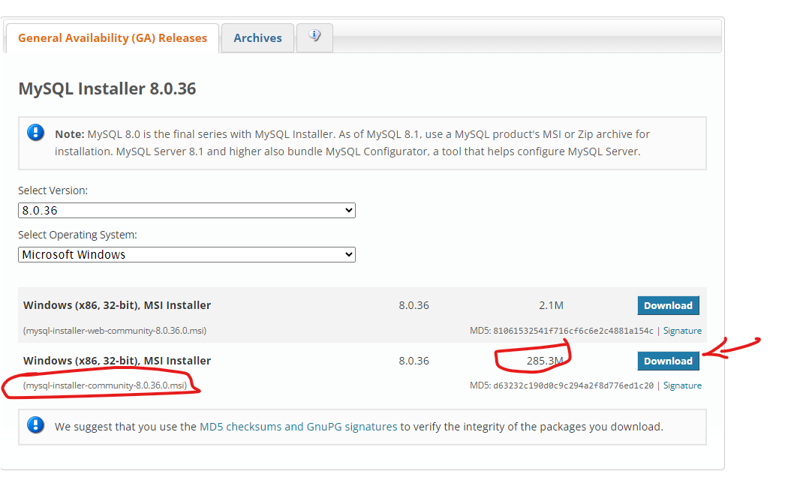

# ScrapperE

ScrapperE is a Django project for web scraping.

## Prerequisites

Before you begin, ensure you have met the following requirements:

* You have installed the latest version of Anaconda.
* You have a `<Windows/Linux/Mac>` machine. State which OS is supported/required.
* You will also need MySQL Workbench for this project. You can download it from the following link: 
  [MySQL Workbench](https://dev.mysql.com/downloads/installer/)
  


## Installing ScrapperE

To install ScrapperE, follow these steps:

1. Clone the repository:
    ```
    git clone https://github.com/ming0520/bitcoin_scrap.git
    ```

2. Navigate to the project directory:
    ```
    cd scrapperE
    ```

3. Rename the environment name in `environment.yml` file:
    ```
    Open the `environment.yml` file and replace the `name: fws-dell` line with `name: new_environment_name`
    ```
Please replace `'new_environment_name'` with your actual environment name.
    

4. Create a conda environment:
    ```
    conda env create -f environment.yml
    ```

5. Activate the conda environment:
    ```
    conda activate "your_environment_name"
    ```

6. Configure the database in `scrapperE\scrapperE\settings.py`:
    ```
    DATABASES = {
        'default': {
            'ENGINE': 'django.db.backends.postgresql',
            'NAME': 'your_database_name',
            'USER': 'your_username',
            'PASSWORD': 'your_password',
            'HOST': 'localhost',
            'PORT': '5432',
        }
    }
    ```
Please replace `'your_database_name'`, `'your_username'`, and `'your_password'` with your actual database name, username, and password respectively.


## Using ScrapperE

To use ScrapperE, follow these steps

1. Load the database data:
    ```
    python manage.py loaddata database_dump.json
    ```

2. Apply migrations:
    ```
    python manage.py migrate
    ```

3. Run the server:
    ```
    python manage.py runserver
    ```

## Dump Database data to database_dump.json
```
set PYTHONIOENCODING=utf-8
python manage.py dumpdata > database_dump.json
```

## Navigate to Views

For more details about the views, please refer to [Views Readme](scrapperE/scrap/ViewsReadme.md)

## Creating a Scheduler in Windows

To automate the scraping process, you can create a scheduler in Windows. Here are the steps:

1. Open Task Scheduler in Windows.

2. Click on "Create Basic Task..."

3. Name the task and add a description.

4. Choose the frequency of the task (Daily, Weekly, etc.)

5. Set the time for the task to run.

6. In the "Action" step, choose "Start a program".

7. In the "Add arguments" field, input one of the following as per your requirement:

    - For daily data scraping and saving:
        ```
        /K "conda activate fws-dell && python "C:\Other Project\Ads\Bitcoin Scraping\scrap.py" save_daily  && exit"
        ```
    - For hourly data scraping and saving:
        ```
        /K "conda activate fws-dell && python "C:\Other Project\Ads\Bitcoin Scraping\scrap.py" save_hourly  && exit"
        ```
    - For scraping and saving data for today:
        ```
        /K "conda activate fws-dell && python "C:\Other Project\Ads\Bitcoin Scraping\scrap.py" scrap_today  && exit"
        ```
    - For minutely data scraping and saving:
        ```
        /K "conda activate fws-dell && python "C:\Other Project\Ads\Bitcoin Scraping\scrap.py" save_minutely  && exit"
        ```

8. Click "Finish" to create the task.

Now, the script will run automatically at the time you set, scraping data and saving it daily.


## Data Sources use in this project

### Bitcoin
1. [Bitstamp OHLC](https://www.bitstamp.net/market/tradeview/)

### Reddit Communities

1. [CryptoCurrency Trading](https://www.reddit.com/r/CryptoCurrencyTrading/)
2. [Bitcoin - A Peer to Peer Electronic Cash System](https://www.reddit.com/r/btc/)
3. [Bitcoin for Beginners](https://www.reddit.com/r/BitcoinBeginners/)
4. [Bitcoin - The Currency of the Internet](https://www.reddit.com/r/Bitcoin/)

## Additional Data Sources

### Tweet

Keywords related to bitcoin: "Bitcoin", "BTC", "Bitcoins", "#Bitcoin", "#BTC", "#Bitcoins"

1. Full-length versions of tweets over 140 characters were collected using the following resources:
    - [Developer Twitter - Counting Characters](https://developer.twitter.com/en/docs/counting-characters)
    - [Developer Twitter - API Search Overview](https://developer.twitter.com/en/docs/twitter-api/v1/tweets/search/overview)
2. Tweepy was used.
3. All web scrapers were avoided to respect the restrictions of the Twitter API, which are meant to protect Twitter users.
4. Keywords related to bitcoin such as “bitcoin”, “bitcoins”, “Bitcoin”, “Bitcoins”, “BTC”, “XBT”, and “satoshi” were used. Hashtags of Bitcoin’s ticker symbols including “#XBT”, “$XBT”, “#BTC”, and “$BTC” were also used.
5. Other keywords like "Bitcoin", "BTC" and “Bitcoins” and hashtags like #Bitcoin", "#BTC", "#Bitcoins" were utilized.
6. Twitter accounts like BitcoinNews(@BTCTN), CryptoCurrency(@cryptocurrency), CryptoYoda (@CryptoYoda1338), BitcoinMagazine (@BitcoinMagazine), Bitcoin Forum (@BitcoinForums), CoinDesk (@coindesk) and Roger Ver (@rogerkver)

### Reddit

- [Bitcoin - The Currency of the Internet (reddit.com)](https://www.reddit.com/r/Bitcoin/)
- [Bitcoin Reddit - The Best Subreddits for Crypto Trading - Cryptocointrade](https://www.cryptocointrade.com/crypto-trading-blog/best-subreddits-reddit-crypto-trading/#:~:text=Bitcoin%20Reddit%20%E2%80%93%20The%20Best%20Subreddits%20for%20Crypto,5%205.%20Ethfinance%20...%206%206.%20Cryptocurrency%20)
- [CryptoCurrency Trading (reddit.com)](https://www.reddit.com/r/CryptoCurrencyTrading/)
- [Bitcoin - A Peer to Peer Electronic Cash System (reddit.com)](https://www.reddit.com/r/btc/)
- [Bitcoin for Beginners (reddit.com)](https://www.reddit.com/r/BitcoinBeginners/)
- [The 8 best subreddits for cryptocurrency and Bitcoin (inverse.com)](https://www.inverse.com/innovation/best-subreddits-for-cryptocurrency-bitcoin)
- [List of all 43 Bitcoin subreddits : r/Bitcoin](https://www.reddit.com/r/Bitcoin/comments/1bj514/list_of_all_43_bitcoin_subreddits/)

### Media Expert News Source:

1. CoinDesk
    - [Crypto Fear & Greed Index Hits Highest Level Since Bitcoin's 2021 Record High (coindesk.com)](https://www.coindesk.com/consensus-magazine/2024/02/14/crypto-fear-greed-index-hits-highest-level-since-bitcoins-2021-record-high/)
2. CoinTelegraph
3. NewsBTC
4. [Crypto Fear & Greed Index | CoinStats](https://coinstats.app/fear-and-greed/)

### Raw Data

Raw data obtained from [http://us.spindices.com](http://us.spindices.com/), last accessed: May 6, 2016.

## Contact

If you want to contact me you can reach me at `<your_email@address.com>`.

## License

This project uses the following license: `<license_name>`.

## Future Enhancements

- [ ] Add raw tweet text and their timestamps
- [ ] Ensure all dates and times are converted to GMT+0
- [ ] Include search volumes, social media shares or mentions of Bitcoin
- [ ] Track Facebook reshares
- [ ] Monitor Bitcoin client downloads and the number of unique users, proxied using heuristics on the blockchain
- [ ] Record closing price
- [ ] Ensure merged dataset includes price, sentiment, and time features
- [ ] Use Time-Series and Sentiment Analysis to detect the Determinants of Bitcoin Prices
- [ ] Track bcp Bitstamp daily closing price
- [ ] Monitor totbc Total daily number of Bitcoins in circulation
- [ ] Record ntran Total daily number of unique Bitcoin transactions
- [ ] Track bcdde Bitcoin days destroyed for any given transaction
- [ ] Monitor exrate Daily exchange rate between the USD and the euro ($/€)
- [ ] Record sp Standard & Poor‟s 500 stock market daily index
- [ ] Track hash Processing power required for the secure operation of Bitcoin network (in billions of hashes per second)
- [ ] Monitor wiki Daily number of Bitcoin search queries on Wikipedia
- [ ] Record google Daily number of Bitcoin search queries on Google
- [ ] Track ntweets Daily number of Twitter posts related to Bitcoins
- [ ] Monitor sent Daily sentiment ratio of Twitter posts related to Bitcoins